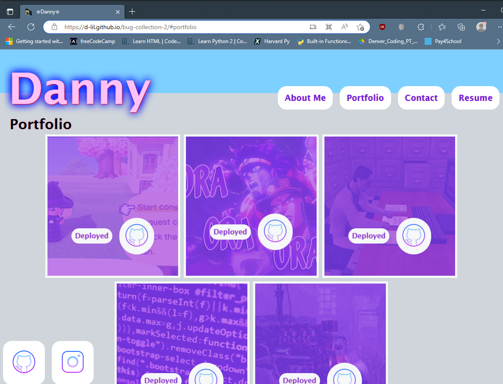

# Bug-Collection-2
  [](https://opensource.org/licenses/MIT)

  A portfolio about me and of some of my projects. The portfolio is written in React.

  ---

  ## Table of Contents:
  * [Installation](#installation)
  * [Usage](#usage)
  * [License](#license)
  * [Contributing](#contributing)
  * [Tests](#tests)
  * [Questions](#questions)

  ---

  ## Installation:
  To install the dependencies needed, open the console and run:
  ```md
  npm i
  ```

  ---

  ## Usage:

  Install dependencies and type in the terminal:
  ```md
  npm run start 
  ```
  Otherwise, just click the link below and select from each link at the top of the page.

  > https://d-lil.github.io/bug-collection-2/

  
  ```md
  This is the home page/about me. You just read it, if you feel like it.
  ```
  
  ```md
  This is my portfolio page showing previous projects.
  ```
  >Some of the projects are spun down and don't open or are through the terminal only, so the "Deploy" link won't work for all of them.

  
  ```md
  This is where you would be able to contact me from, but it isn't connected to a mailto, so it is just there to look pretty for now.
  ```
  
  ```md
  This page contains a link where my resume can be downloaded to your page and saved for future reference *wink wink*
  ```
  
  ---

  ## License:
  The MIT License (MIT)

      Copyright (c) undefined undefined
      
      Permission is hereby granted, free of charge, to any person obtaining a copy of this software and associated documentation files (the "Software"), to deal in the Software without restriction, including without limitation the rights to use, copy, modify, merge, publish, distribute, sublicense, and/or sell copies of the Software, and to permit persons to whom the Software is furnished to do so, subject to the following conditions:
      
      The above copyright notice and this permission notice shall be included in all copies or substantial portions of the Software.
      
      THE SOFTWARE IS PROVIDED "AS IS", WITHOUT WARRANTY OF ANY KIND, EXPRESS OR IMPLIED, INCLUDING BUT NOT LIMITED TO THE WARRANTIES OF MERCHANTABILITY, FITNESS FOR A PARTICULAR PURPOSE AND NONINFRINGEMENT. IN NO EVENT SHALL THE AUTHORS OR COPYRIGHT HOLDERS BE LIABLE FOR ANY CLAIM, DAMAGES OR OTHER LIABILITY, WHETHER IN AN ACTION OF CONTRACT, TORT OR OTHERWISE, ARISING FROM, OUT OF OR IN CONNECTION WITH THE SOFTWARE OR THE USE OR OTHER DEALINGS IN THE SOFTWARE.

  ---

  ## Contributing:
  N/A to add to the project.

  References to the sites used for pictures are listed below:
  * icons8.com
  * https://upload.wikimedia.org/wikipedia/en/f/f6/Spike_Spiegel_as_drawn_by_the_creators.jpg
  * https://assetsio.reedpopcdn.com/animal_crossing_terraforming_16.jpg?width=1200&height=1200&fit=bounds&quality=70&format=jpg&auto=webp
  * https://i.ytimg.com/vi/o5lj1Pgjruo/maxresdefault.jpg
  * https://thenerdstash.com/wp-content/uploads/2022/10/How-to-get-Void-Energy-in-Dead-by-Daylight.jpg
  * https://media.runthinkshootlive.com/2011/05/1024-typical-disaster-03.jpg
  * https://img.myloview.com/murals/computer-science-lesson-hacker-api-text-on-the-computer-screen-screen-of-web-developing-javascript-code-javascript-code-in-text-editor-css-javascript-and-html-usage-700-138798221.jpg

  ---

  ## Tests:
  N/A

  ---

  ## Questions:
  If you have questions, you may contact me on [GitHub](https://github.com/d-lil) or you may reach out by contacting Daniel Liljegren at dahneel@gmail.com
